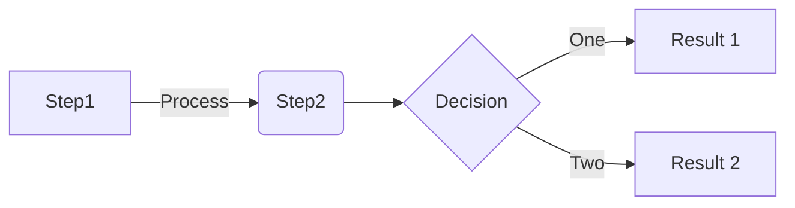

# Workshop Agenda
## Day 1
| Time Slot| Activity     | 
|--------------|----------|
| 9am - 10am | Introduction   |
| 9am - 11am | Phase 1    |
| 11am-11:15am    |** 15 Min. Break** |
|11:30am-1pm| Phase 2|
| | ** Break ** |
| | Activity|
| | ** Break **|
|| Wrap Up|

## Day 2
| Time Slot| Activity     | 
|--------------|----------|
| 9am - 10am | Introduction   |
| 9am - 11am | Phase 1    |
| 11am-11:15am    |** 15 Min. Break** |
|11:30am-1pm| Phase 2|
| | ** Break **|
| | Activity|
| | ** Break **|
| | Wrap Up|

## Diagram Examples
## [Merimaid Diagrams](https://mermaid.js.org/intro/)
## Markdown in VS Code https://code.visualstudio.com/Docs/languages/markdown
