# Module 00 - Lab Environment Setup & General Setup and configuration 
``` 
**Sample Application**

https://ms-poc-sdg-ui.azurewebsites.net/

Credentials
  username: search-admin@emtecexpzone.onmicrosoft.com
  password: ask administrator

```
## Glossary
### NER - Name Entity Recognition

## Setup


#### Deploy to Azure is in Progress
-  [Create Deploy to Azure Template](https://learn.microsoft.com/en-us/azure/azure-resource-manager/templates/deploy-to-azure-button)

1. Check against the PowerPoint

## Prerequisites
* An [Azure account](https://azure.microsoft.com/free/) with an active subscription.
* Owner permissions within a Resource Group to create resources and manage role assignments.
* The subscription must have the following resource providers registered.
  * Microsoft.Authorization
  * Microsotft.Search
  * Microsoft.Storage
  * Databricks
  * Language Studio
  * App Service
  * Functions
  * **todo**  Enumerate other service

## Outline

1. Deploy Azure Storage and Azure Language Service 
1. Train the NER Language Model *Performing this operation first because it takes some time* 
1. Deploy all of the necessary Azure services
3. Gather all of the endpoint and keys necessary outlined in the documentation
2. Configure the Azure Functions and Web App
1. Test Application
1. Deploy & Configure DataBricks
1. Process Data with OpenAI 

## High Level Lab Environment Setup

1. Deploy a Resource Group named : *LabSetup*
1. [Deploy Azure Storage Account](#deploy-azure-storage-account)
1. [Deploy Language Service](#deploy-language-service)
1. [Train the Custom [NER](#ner---name-entity-recognition) Here : [Language Model](./part_1.md)
1. [Deploy Azure Cogntive Search]() (add link to docs)
1. [Deploy Azure Databricks (Free Tier)](part_databricks.md) 

 
1. [Install Service BUS]() (Type Service Bus) (add link to docs)
    - Basic
    - Create a Queue 
        - Named: DocumentEntitySkillSetExecuted

1. [Web App Frontend](#deploy-web-app-service-front-end)
1. [Web App Backend](#deploy-web-app-service-backend-api)
    - Create Two Web App Services (add link to docs)
1. [SQL Database](#deploy-azure-sql-database)
    - SQL Use Authentication
1.[Install Azure Function](./part_00.1.md)


## Deploy Azure Storage Account
From the Azure Portal in the resource group for the lab create an Azure Storage Account. [Documentation](https://learn.microsoft.com/en-us/azure/storage/common/storage-account-create?tabs=azure-portal)

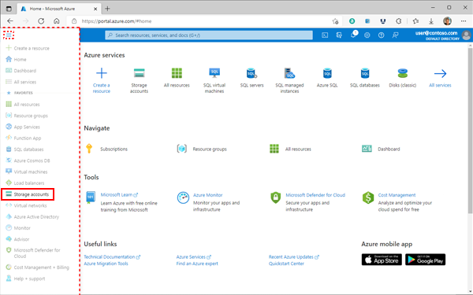
Choose the following options for this resource:
1. Resource Group: Use the resource group you created for the Lab.
1. Storage Account Name: Enter a unique name
1. Region: Select the same *Region* as your Lab. 
1. Performance "Standard"
1. Redundancy LRS (Locally Redundant Storage)
1. Keep the defaults for other options then click **Review >> Create**. 

# Create the following Containers in Azure Storage 
1. Create a blob storage contained named : **sdgstorage**
1. Create a blob storage contained named : **storagesearchdocs**
1. Create a blob storage contained named : **esg-ls-training**
1. Create a blob storage contained named : **esg-documents**


## Deploy Language Service
1. From within the Lab Resource group, Click *Create* and Enter *Language Service* into the Search Box. Select the *Language Service*
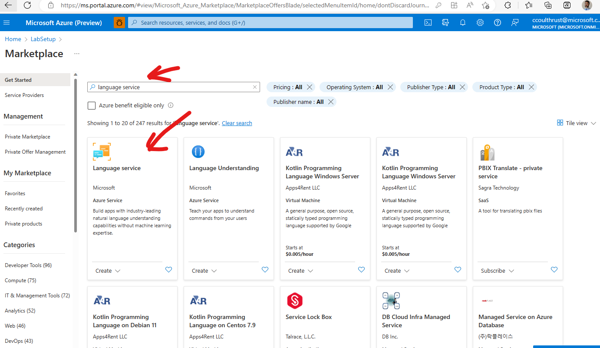
1. Click the Language Service and you will arrive at the "Addtional Features* screen. Select the feature *Custom text Classification & Custom Named Entity Recognition* . Then *Click*  **Continue to create your resource**.

1. Resource Group: Use the resource group you created for the Lab.
1. Region: Select the same *Region* as your Lab. 
1. Enter a unique name for the language resource.
1. Select *Free Pricing Tier* 
1. Storage Account :Select *Existing* and the storage account you previously created for this Lab.
1. Check the *Disclosures* Check box.
1. Click **Review>>Create**
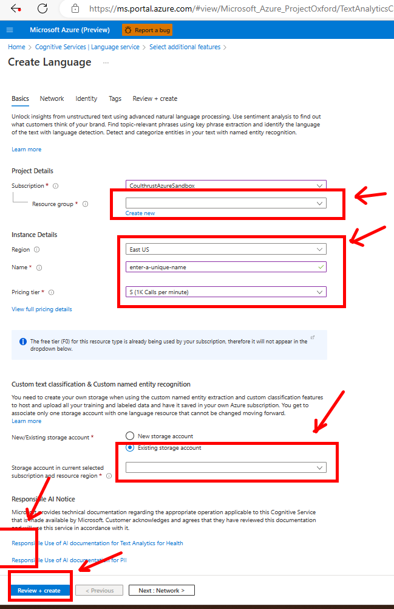
## Deploy Web App Service Front End 
This Application Requires two **Azure Web App** services, one for the front end application and a second for the Backend API layer.
1. From within the Lab Resource group, Click *Create* and Enter *Web App* into the Search Box. Select the *Web App*
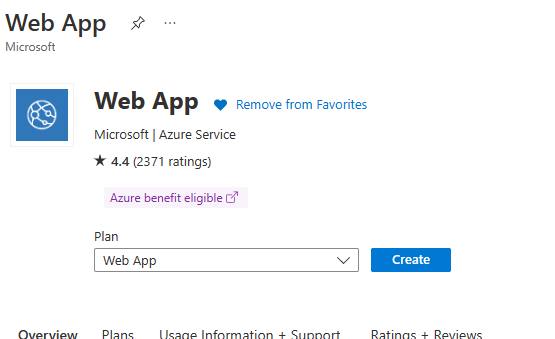

    Create a *Web App* for the front end with the following parameters.
    1. Resource Group: Use the resource group you created for the Lab.
    1. Name: Enter a unique name for the front end eg. esg_ui_xxxx where xxxx is a unique number.
    1. Publish : Select *Code*
    1. Runtime Stack: Node 10 LTS
    1. Region: Select the same *Region* as your Lab. 
    1. Windows Plan : Select "Free" or "D1 Shared"
    1. Select *Free F1 (Shared Infrastructure)* 
    1. Click the "Monitoring" tab and *Disable Application Insights*.
    1. Click **Review>>Create**
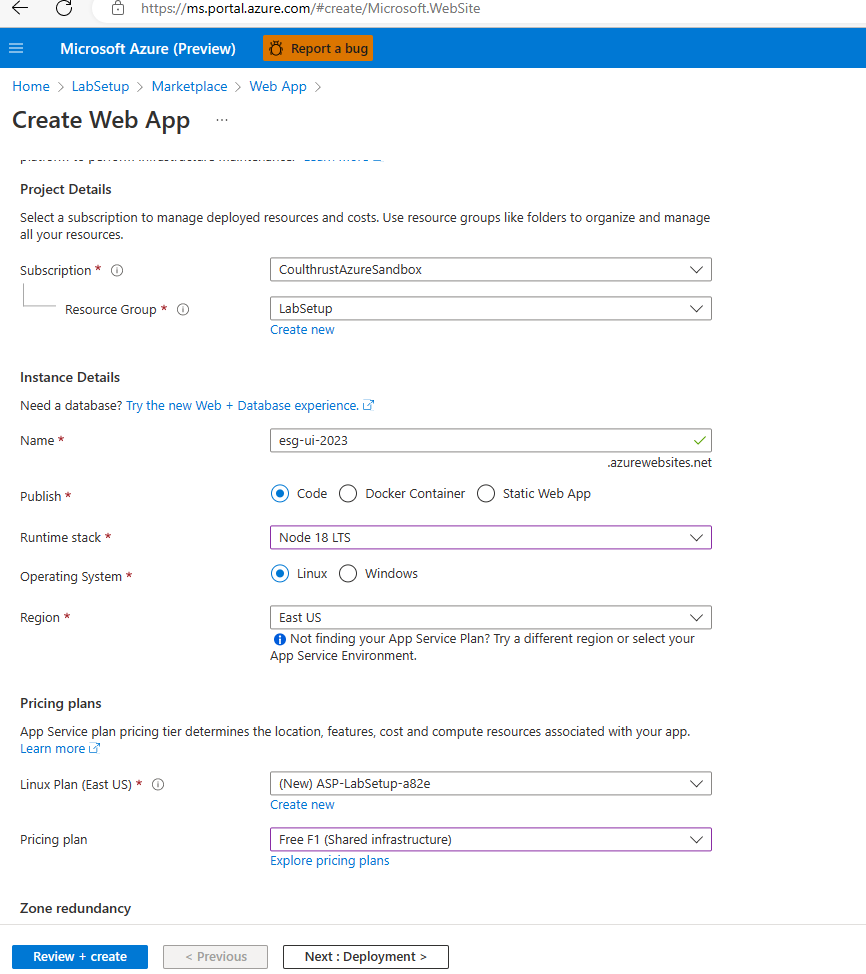


## Deploy Azure Service Bus
1. From within the Lab Resource group, Click *Create* and Enter *Service Bus* into the Search Box. Select the *Service Bus
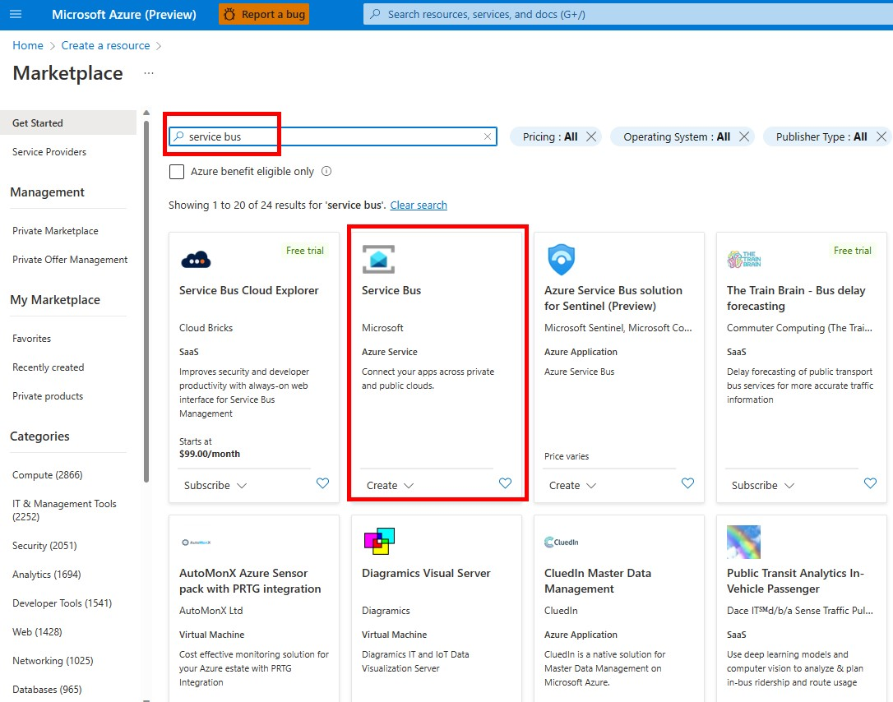
1. Complete the details for the creation of the **Service Bus**
    * Resource Group : Same as your **Lab**
    * Name Space : Unique Name
    * Location : Same as your **Lab** region 
    * Pricing : Basic
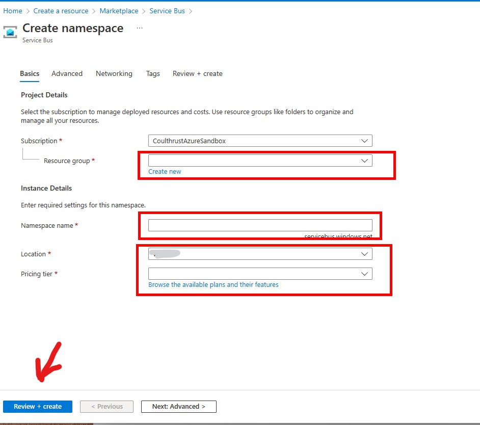


## Deploy Web App Service Backend API 
1. From within the Lab Resource group, Click *Create* and Enter *Web App* into the Search Box. Select the *Web App*
 Create a *Web App* for the front end with the following parameters.
    1. Resource Group: Use the resource group you created for the Lab.
    1. Name: Enter a unique name for the front end eg. esg_ui_xxxx where xxxx is a unique number.
    1. Publish : Select *Code*
    1. Runtime Stack: DotNet - v6.0
    1. Region: Select the same *Region* as your Lab. 
    1. Windows Plan : Select "Free" or "D1 Shared", or leave default if not selectable.
    1. Click the "Monitoring" tab and *Disable Application Insights*.
    1. Click **Review>>Create**
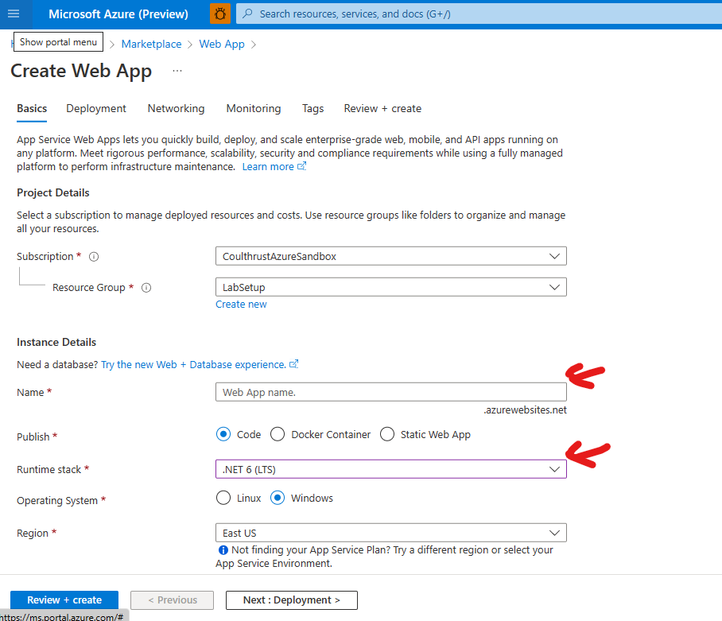
   
# Deploy Function App
This application requires two function app services. From within the Lab Resource group, Click *Create* and Enter *Function App* into the Search Box. Select the *Function App*
"Type Function App"
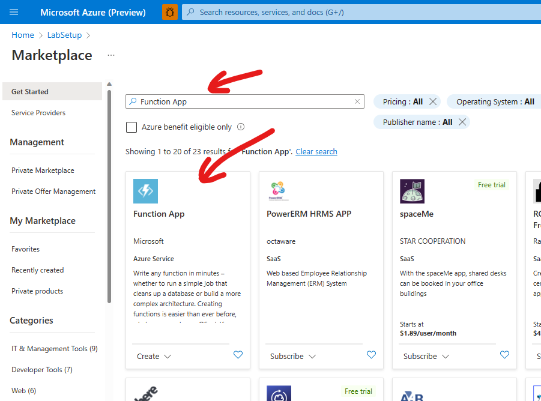

The Function Apps will be used for Search Event Subscriber and Language Cognitive Services , so name them appropriately eg. EventSubFuncxxx  and LangCogFuncxxx, the names will need to be globally unique therefore the "xxxx" denotes a unique number.
Use the following setting for each function app, repeat this process *two times*.
1. Resource Group: Use the resource group you created for the Lab.
1. Name: Enter a unique name for  end eg. esg_funcapp_xxxx where xxxx is a unique number.
1. Publish : Select *Code*
1. Runtime Stack: .NET
1. Region: Select the same *Region* as your Lab. 
1. Windows Plan : Select "Free" or "D1 Shared", or leave default if not selectable.
1. Operating System: Windows
1. Plan Type : Consumption(Serverless)
1. Click **Review>>Create**
Note : The app will need to be registered in the App Registry for AD Authentication. **DOCUMENT THIS STEP**


# Deploy Azure SQL Database
1. From within the Lab Resource group, Click *Create* and Enter *Web App* into the Search Box. Select the *Azure SQL* tile.
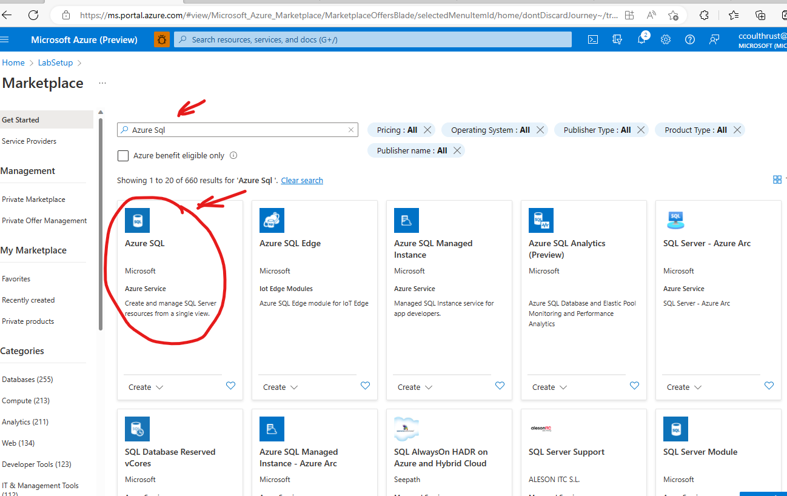
1. Click **Create** in the *Azure SQL* dialog.

1. Select SQL Database as the *Deployment Option*
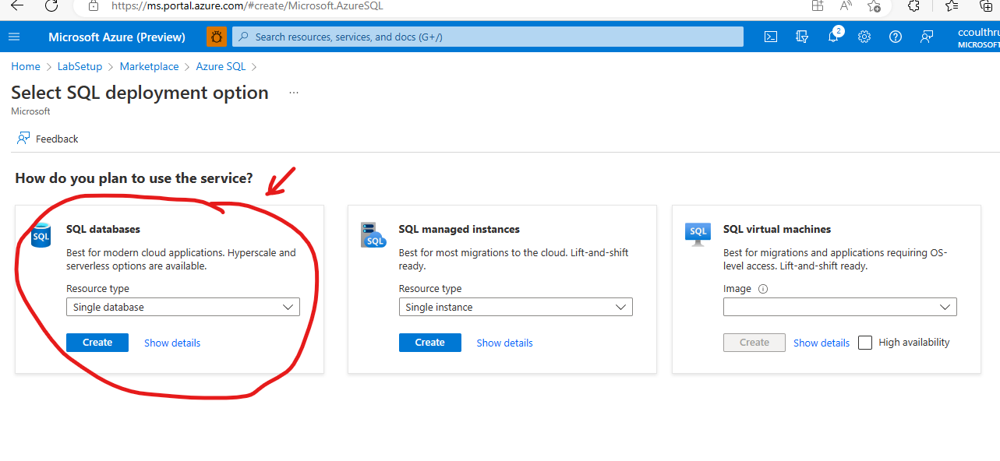

1. Configure Azure SQL DB , An Azure SQL Server will need to be created to contain the database. *Click*  **Create New**
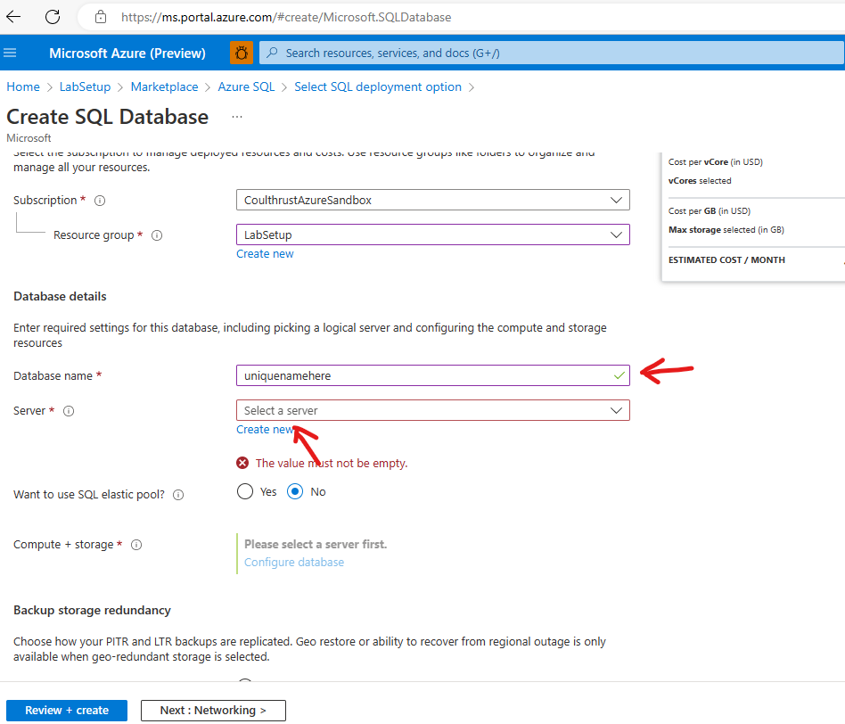

### Create Database Server
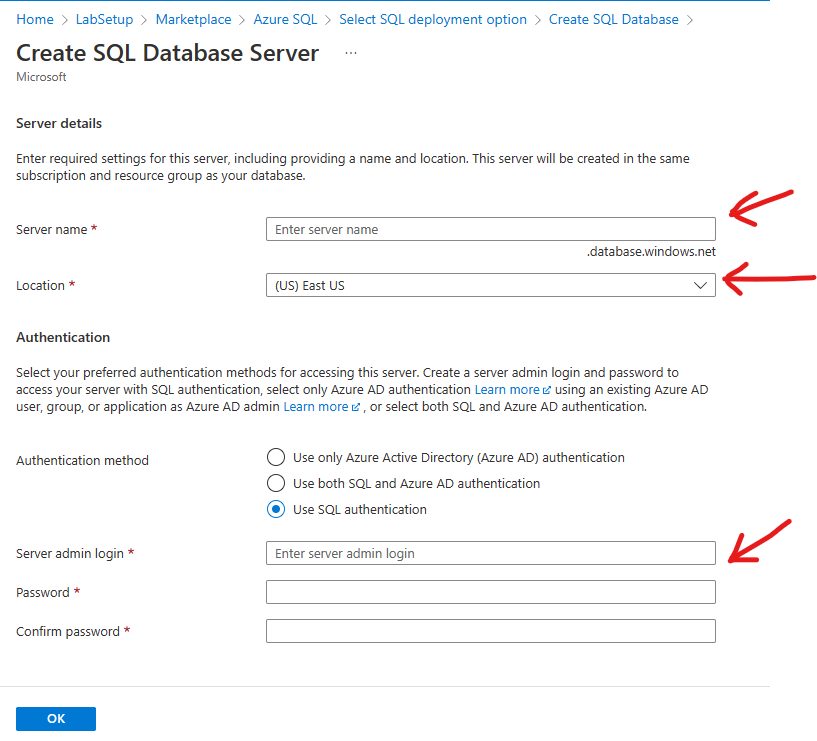
Enter the Following Details for the Azure SQL Database Server
1. Server Name: Enter A Globally Unique Server Name
2. Location : Select the same *Region* as your Lab. 
3. Authentication : **Use SQL Authentication**
4. User Name: sqladmin
5. Password: Enter a password and retain it somewhere handy for following steps.

Continue Create Azure SQL Database
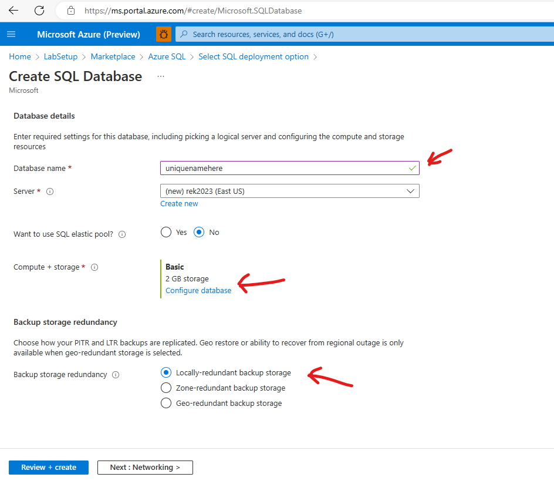

Click on *Configure database* to configure

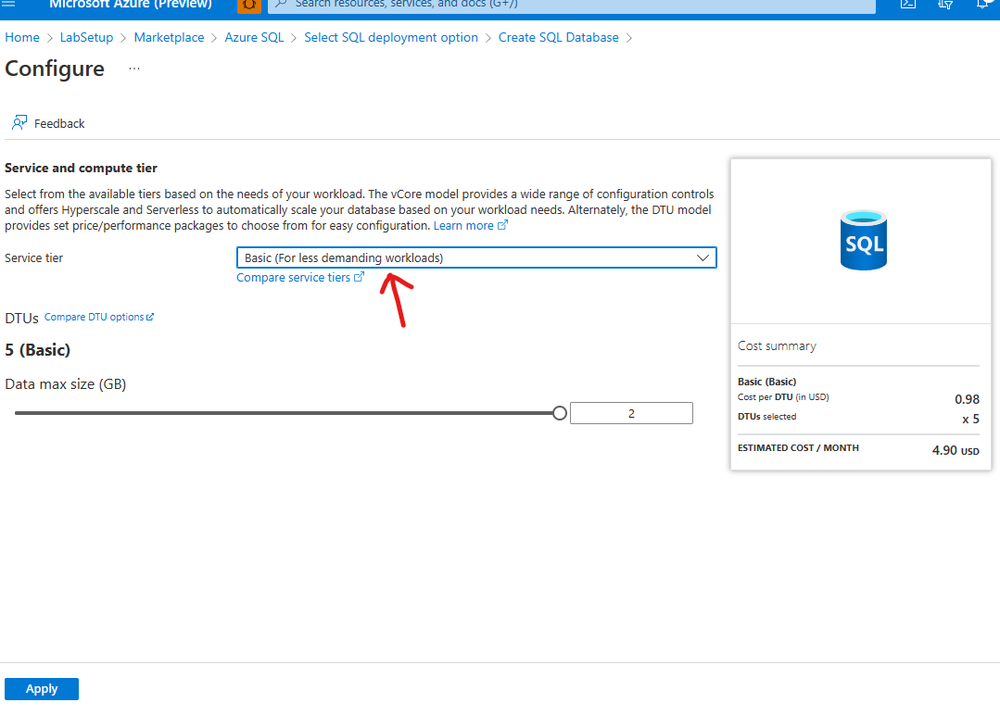
    1. Select *Basic* for the Service Tier

You will return to the dialog for *Create SQL Database* and must complete this setup.
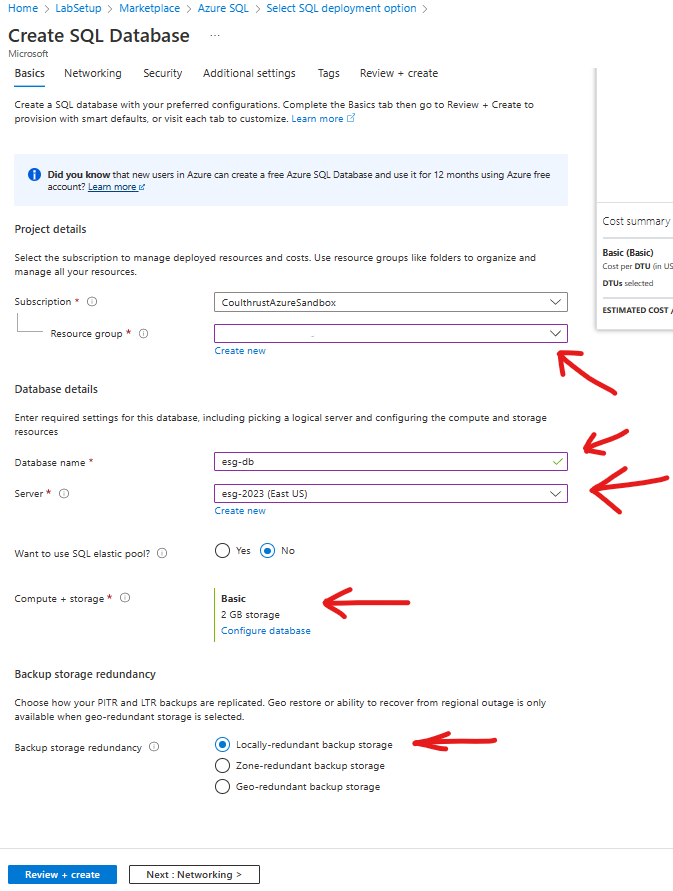
Enter the following Values

    1. Resource Group: Use the resource group you created for the Lab.
    1. Database Name: *esg-db*
    1. Server: Choose the Azure SQL Server you created in the previous step.
    1. Elastic Pool: No
    1. Compute + Storage : Should be at *Basic* from the preceding step.
    1. Windows Plan : Select "Free" or "D1 Shared", or leave default if not selectable.
    1. Click the "Monitoring" tab and *Disable Application Insights*.
    1. Click **Review>>Create**
1.Ensure the you have network access to the *Azure SQL Server*. Navigate to the *Azure SQL Server* you created. In the Azure Portal. *Click* **Networking**. *Click* **Selected Networks**. *Click* **Add Your Client IPV4 Address**,. *Click* **Save**
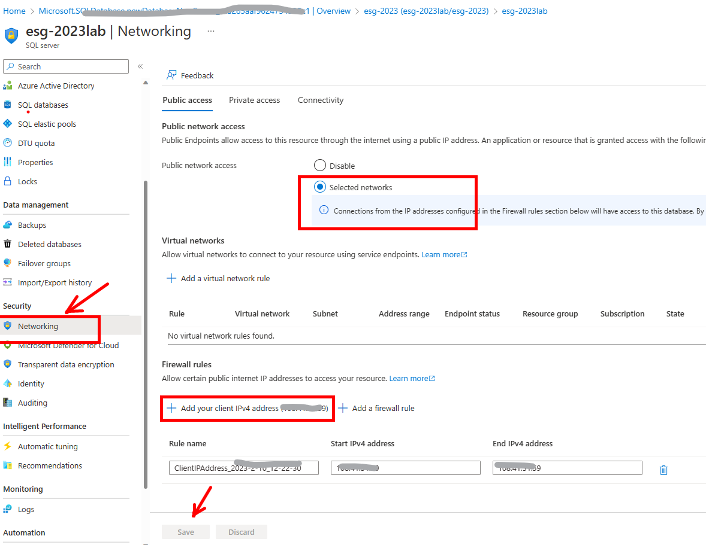 
1. Runs the SQL Setup Scripts to create the Database. 
  - Navigate to the SQL Database you created. *Click* the name of the database you created in the previous step.
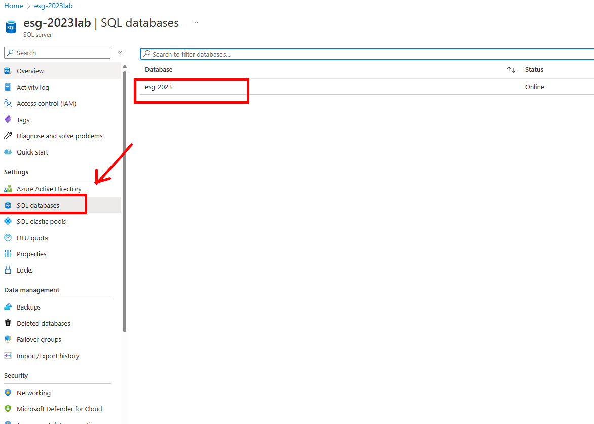
1. *Click* **Query editor(Preview)**
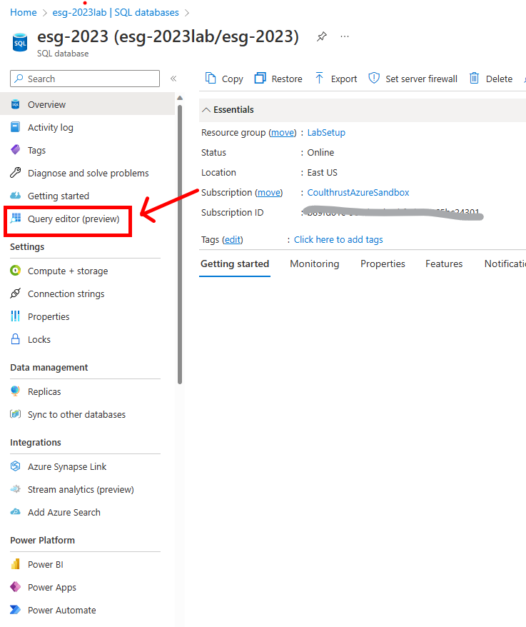
1. Populate the database with tables and stored procedures
        The scripts are located [here](../databasescripts)
* Navigate the the Azure Cloudshell CLI in the Azure Portal or *Navigate* to http://shell.azure.com 
* Copy database_scripts.zip to the *clouddrive*
    * *Click*  Upload Files in cloudshell
    * Supply the directory of the github location of the database scripts
    https://github.com/appliedcognetics/esgWorkshop/blob/main/src/workshop/databasescripts/database_scripts.zip?raw=true
* From the cloudshell CLI type  
    * **cd clouddrive**
    * **unzip database_scripts.zip**
    * Type cloudshell in the **clouddrive* directory  Run 
    sh db_bashscript.sh , then press **ENTER**

run the scripts that were uploaded into the directory clouddrive
# Set the environment variables for sqlcmd

export SQLCMDPASSWORD= **Your SQL Admin Password**
export SQLCMDDBNAME=esg-2023
export SQLCMDSERVER= **Your SQL Server Name**
export SQLCMDUSER=sqladmin


 [Continue to Deploy Functions and Web Apps >](../documents/part_00.1.md)
# NEEDS TO BE COMPLETED


