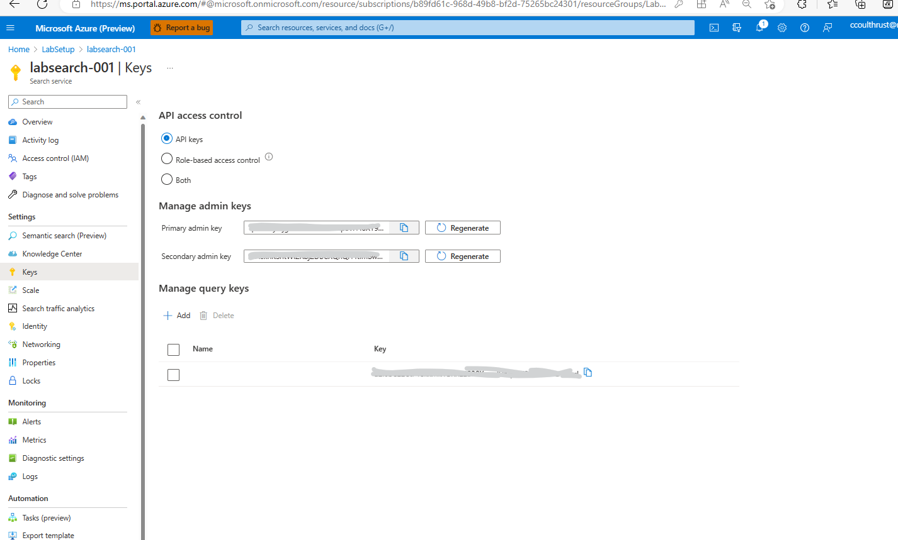
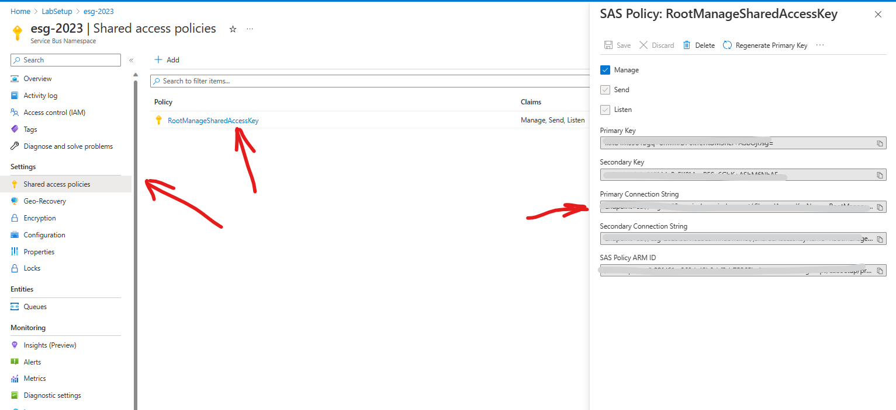
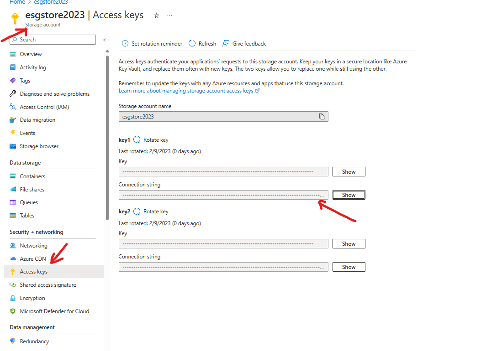

# Setup of Function and Web Apps
[PDF File Re Writing this below](../documents/ms-sdg-poc-publish-setups.pdf)

# Deploy Code into the Functions and the Web App(s)
At this stage we will deploy the code into to the Azure Functions and the Web App Services.

1. Update the URI in the publish package for the front end URI
1. Need tenantID, app registration 

Active Direcotry >> New Registration
Accounts in this organizational directory only (Microsoft only - Single tenant)

Function App: Emtec.Cognitive.Search.EventSubscriber
*Start with Function One*
1. Download function app published code from below path
Path →
SAS URL : https://sdgpublish.blob.core.windows.net/publish?sp=rl&st=2023-02-
09T12:30:02Z&se=2023-02-09T20:30:02Z&spr=https&sv=2021-06-
08&sr=c&sig=o%2Fgy4Zq%2Bw0emHeiTEkUdimbXwcGRLhkplQtsRoazD4Q%3D
File Name : Emtec.Cognitive.Search.EventSubscriber-publish.zip
2. Unzip the published zip file.
3. Login into Azure portal
4. Go to respective resource group
5. Open function app
6. Click on Advanced Tools under Development Tools as shown below
7. Click on ‘Go →’ link

-- Function Use for event Subscriber

# Register a New Application

In the Azure Portal , search for "Azure Active Directory"
 Click *Add* >> App Registration

- For Who can use this application or access this API ?
    Select **Accounts in this organizational directory only (Microsoft only - Single tenant)**
- Click Register
-

# Parameters needed for the Application Function App.
These values will need to be set in the function app config file according to the setup documentation above.

1. SearchIndexerName :  In Azure Search,create an indexer with the name : `azureblob-indexer`
1. SearchIndexName :  In Azure Search,Create an index with the name :`azureblob-index`
1. SearchServiceAdminApiKey : Set to: `[SEARCH SERVICE ADMIN API KEY]`
1. SearchApiKey : Set to:   `[SEARCH SERVICE ADMIN API KEY]`

1. SearchServiceEndPoint : Set to :`https://<search-service name>.search.windows.net` get the name of the Azure Search Service Endpoint from the Azure portal. 

1. ServiceBusConnectionString : Set to: `[SERVICE BUS CONNECTION ENDPOINT` from the Azure Portal. Navigate to the Service Bus Namespace >> Shared Access Policies>> Click RootManageSharedAccessKey. Copy the generated **Primary Connection String**.

1. StorageConnectionString: Set to `[STORAGE CONNECTION_ STRING]` . Navigate to the Storage Account Blade. Click **Access Keys** , Copy the **Connection String**
