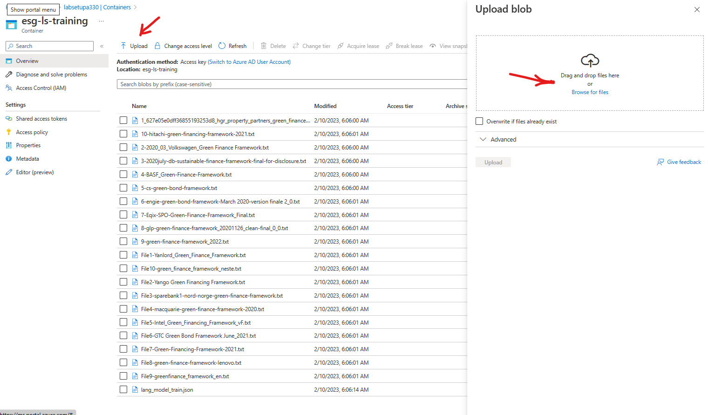
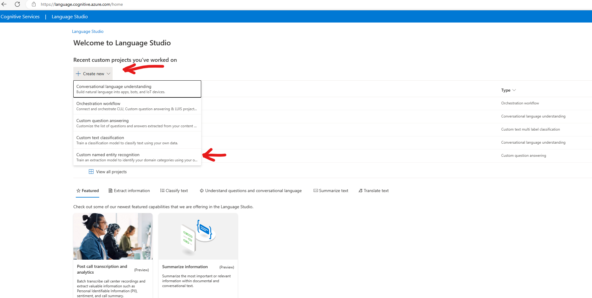
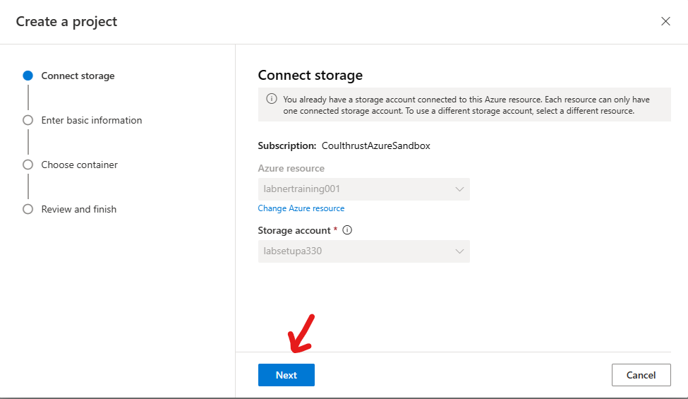
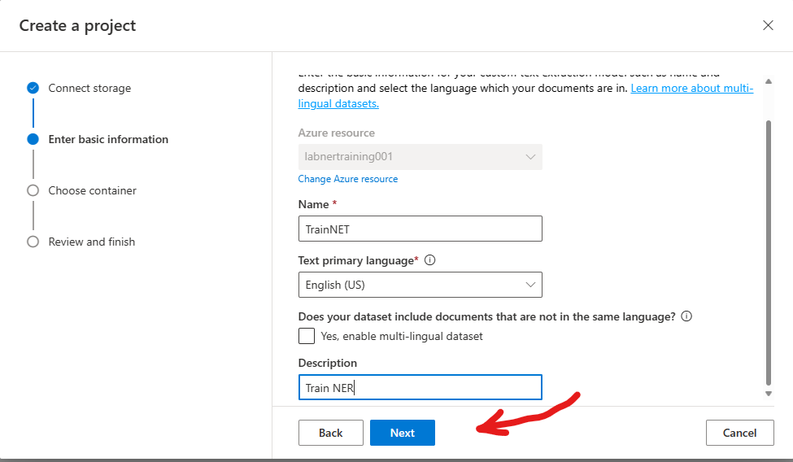
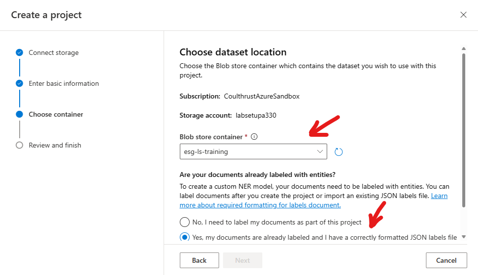
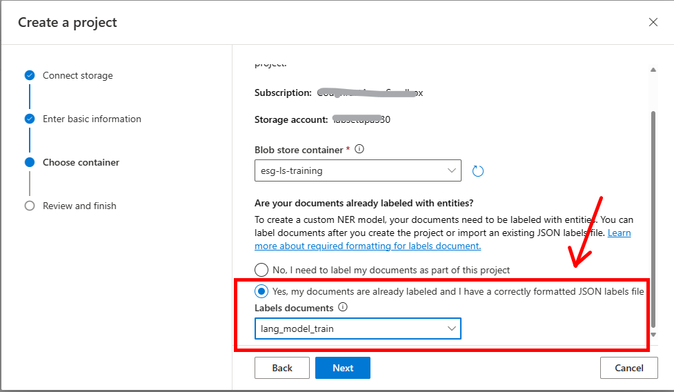
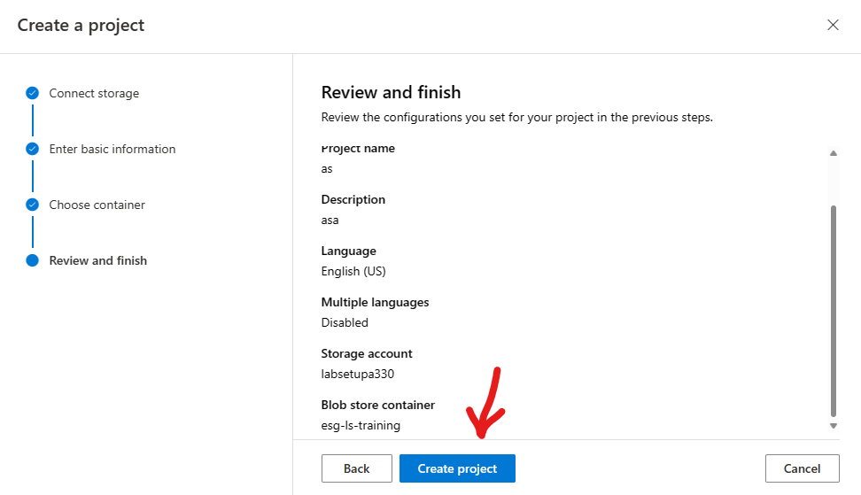
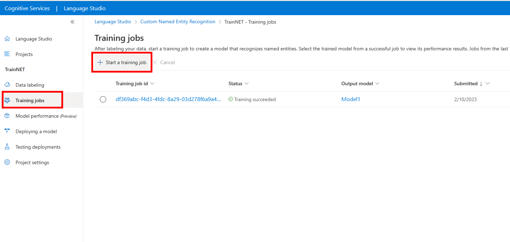
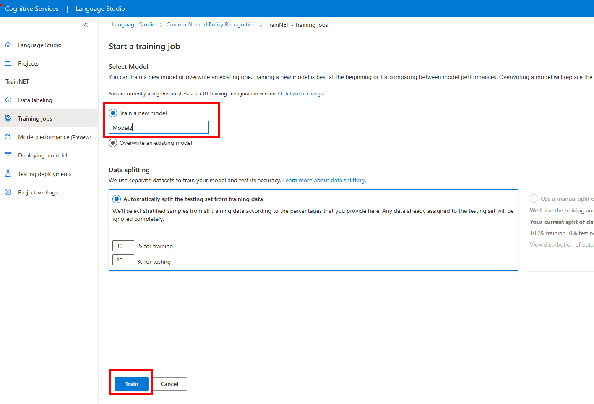
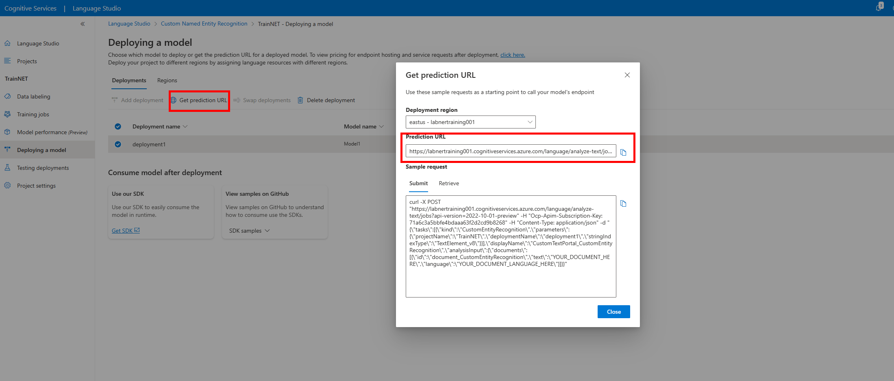

# Lab Custom NER (Named Entity Recognition) Model Training

## Goal 
To train custom NER (Named Entity Recognition) Model for use in the application. The NER model will be trained on ESG documents to recognized to identify relevant ESG data and terms in a document. The results of the NER process will be stored in the Azure SQL Database and the Azure Search Index for use by the application.

``` 
Training of a Custom Vision model to recognize SDG Images is available.
```

1. Ensure prerequistes are completed from [Part 0](documents/part_0.md)  
1. Ensure there is  a *Blob Storage Container* named **esg-ls-training** in the **Storage Account** created earlier.
    - Upload the training data to the *Blob Storage Container* named **esg-ls-training**
    in the directory **src\workshop\data\training\language_studio\TrainingModelFiles**
    - Navigate to  *Blob Storage Container* named **esg-ls-training**
    - *Click* **Upload** , then upload the training data files from your local copy of the training data files. 
 

    **Note Make Sure the language resoure Managed Identity has "Storage Blob Data Owner" Permissions. [Information on Permissions Here ](https://learn.microsoft.com/en-us/azure/cognitive-services/language-service/custom-named-entity-recognition/how-to/create-project?tabs=portal%2Clanguage-studio#roles-for-your-azure-language-resource)**
    - Go to IAM Setting of the Storage Account and set the role for the language studio
    - Choose Storage Blob Owner Role
    - Add Managed Identity to Role
    - Choose the Managed Identity of the *Language Studio* account.

6. Copy the training data and training file to the Blog Storage Container named **esg-ls_training**
3. Navigate to [Language Studio](https://language.cognitive.azure.com/). Login with your same Azure credentials
4. Pick Custom Name Entity Project
 
1. Connect to the training data Storage Account

1. Enter Basic information about the project.

1. Choose the training data location , select **esg-ls-training**. **(If this value is missing , the Storage Account is misconfigured, return to Part 0 Storage account setup.)**

    * *Click* **Yes, my documents are labeled...** , and *Select* **lang_model_train**
    
1. Review the training data location *Click* **Create Project**
ss
1. Discussion about **Data Labeling*  [See Documentation Here](https://learn.microsoft.com/en-us/azure/cognitive-services/language-service/custom-named-entity-recognition/how-to/tag-data)  
1. *Click* **Training** tab , then *Click* **Start 


1. *Click* **Training Jobs** , then *Click* **Start a training job**
1. Use the deployed model in the application, by entering the model name into the Azure Function.
1. Connect the Model to the Application Backend API.
1. *Click* **Get prediction URL**,  *Copy* and save the **Preidiction URL** in a Notepad for later use.

Connect Storage for NER Training, if this was previously done in the setup of the Language Service *Click* **Next**


Enter the basic information for the project
1. Project Name: Enter a project name **TraingNERModel*
1. Primary Language: English (US)
1. Description : Enter a description
1. *Click* **Next**


Choose the *Blob Storage Container* that has your training data
1. Setup *Blob Storage Container* for *Language Studio*


# Discuss Azure Search With the Group