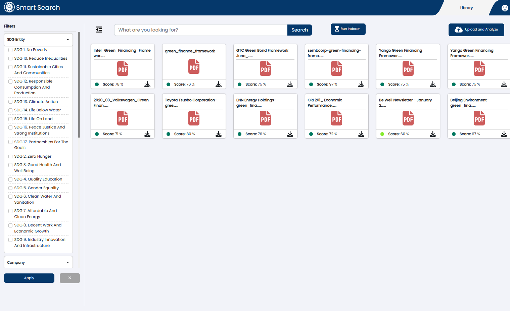
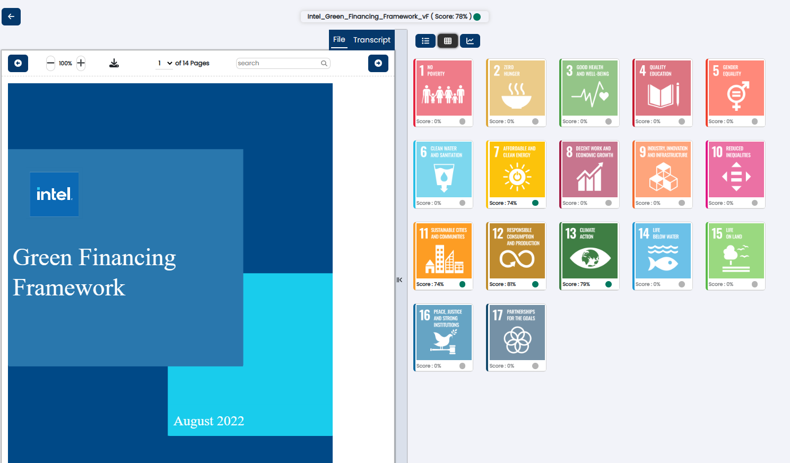
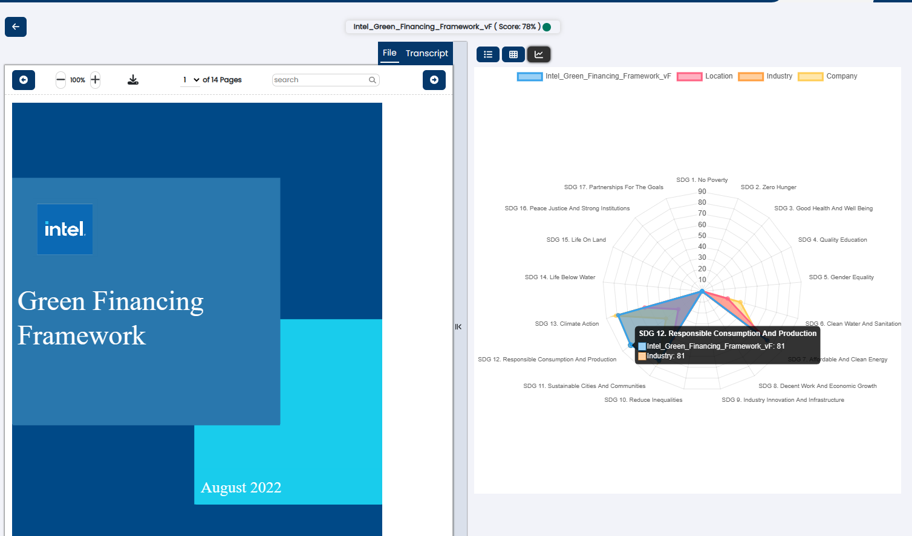
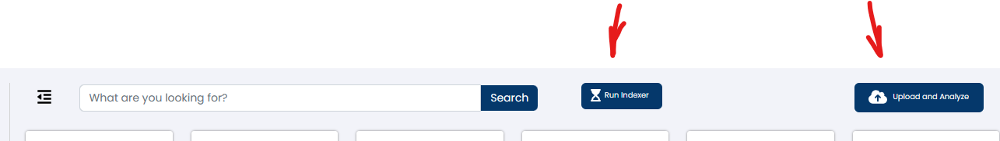

# Review the functionality of the deployed application

## Lab Goals
1. Complete the deployment and test the application
2. Upload documents to trigger the pipelines
3. Discuss how to extend with more Cognitive Services
4. Discuss additional training
5.  ** Stretch Goal ** Add the Vision Service
6. [Move on to OpenAI Section of the Workshop](../documents/part_2.md)

Add Text about the different views of the application
## Landing Page of Application

## ESG Document Drilldown Level 1

## ESG Document Drilldown Level 2

## Uploading A Document & Triggering the Pipeline

