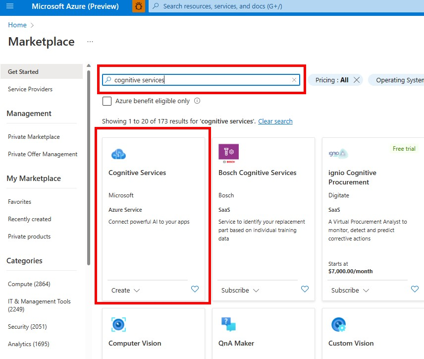
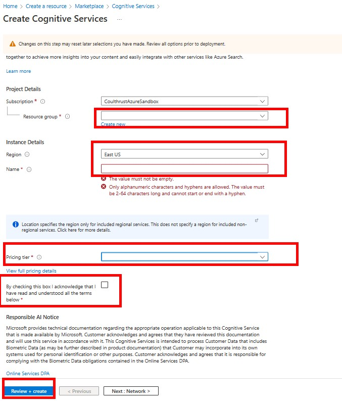
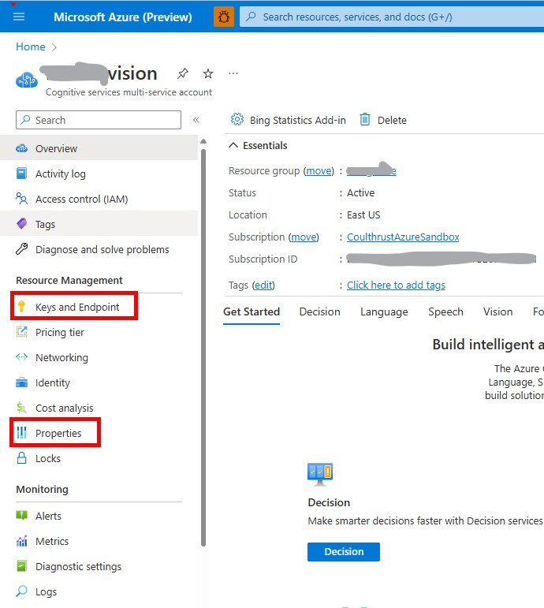
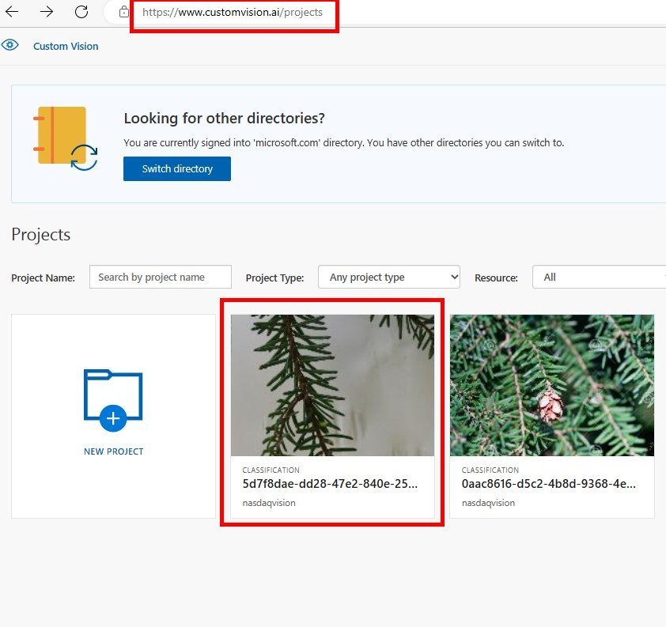
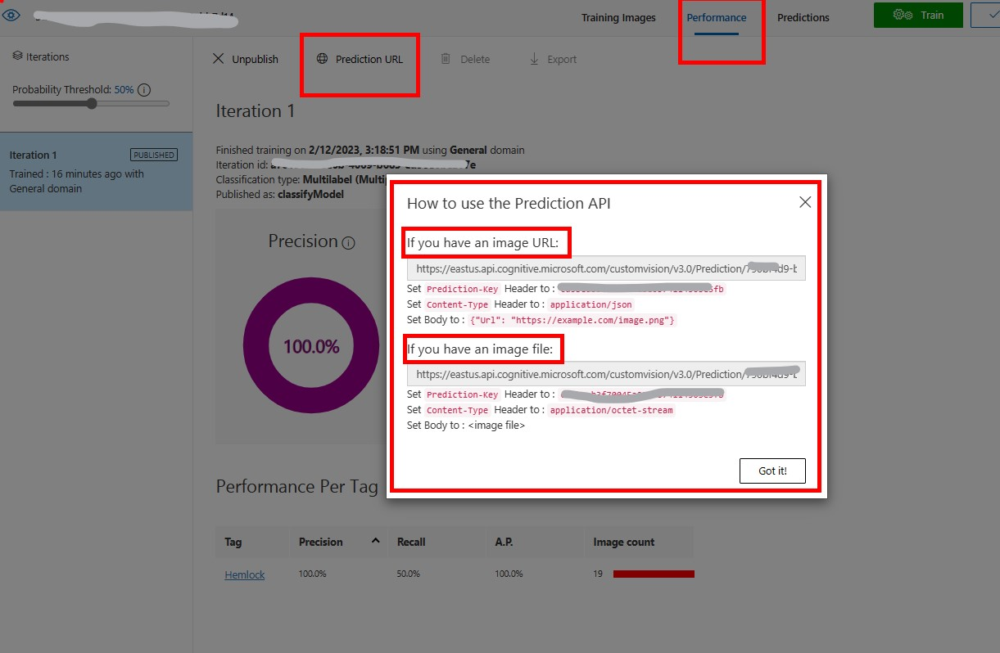

# Azure Cognitive Services and Custom Vision to Recognize SDG Icons

## Goal


Train an **Azure Cognitive Service Custom Vision** Model to Recognize SDG Icons
1. Deploy an **Azure Cognitive Services Multi Service Account**
* *Click* **Create a Resource** and Search for **Cognitive Services**

1. Complete the details for creating the service

1. [**Azure Cognitive Services Custom Vision**](https://learn.microsoft.com/en-us/azure/cognitive-services/custom-vision-service/)
1. [What is Custom Vision?](https://learn.microsoft.com/en-us/azure/cognitive-services/custom-vision-service/overview)
1. *Click* [Azure Custom Vision Studio](https://www.customvision.ai/projects) 
1. Training Custom Vision Model with [Python](https://learn.microsoft.com/en-us/azure/cognitive-services/custom-vision-service/quickstarts/image-classification?tabs=visual-studio&pivots=programming-language-python#upload-and-tag-images) 
1. Select a Domain https://learn.microsoft.com/en-us/azure/cognitive-services/custom-vision-service/select-domain
# Customer Vision Process
- Set the enviroment variables for the *Custom Vision* resource. The Key and the endpoint and Resource ID are available in the ```Azure Portal```>>```Cognitive Services Resource```
    - *Click* ```Keys and Endpoint```
    - Copy ```Endpoint``` needed for **CV_TRAININGENDPOINT**
    - Copy ```Key 1``` needed for **CV_TRAININGKEY**
    - From the```Cognitive Services Resource``` blade *Click* ```Properties```
    - Copy ```Resource ID``` need for **CV_RESOURCEID**

- Put the Images in directories that are named the same as the **labels** that will be applied to the images.
    - Example: If the images represents SDG1 the image must be in a directory named SDG1. The directory names are used as the labels for the images.
- Open the **cloud shell** from the portal or go to [Azure Cloud Shell](https://shell.azure.com)
- The Python script and training images are located [here](../code/customvision/)
- Copy the python script to the **cloudshell**
- From **cloudshell** run ```pip install azure-cognitiveservices-vision-customvision```
- Set the environment variables in the cloudshell before running the python script, you copied these in a previous step.
```bash
export CV_TRAININGENDPOINT
export CV_TRAININGKEY
export CV_RESOURCEID
```
- Run the python to upload & tag the images , then train and publish the model. 
- Get the prediction URL and Endpoint from the [Custom Vision WebSite](https://www.customvision.ai/) 
    - *Click* the **Classification Project** created by the previous run of the python script.
    
    - *Click* the **Performance** tab as shown in the image below.
    - *Click* **Prediction URL**
    - Read the **How to Use the Prediction API** and **Copy** the **Prediction Key** for later use. 
    
- To test the trained model from the  Custom Vision Website, *Click* **Quick Test**
    - Go to the **Test SDG Images** directory or find some sample SDG images to test
    - [UN SDG Collateral](https://www.un.org/sustainabledevelopment/news/communications-material/)
    - [Search](https://www.bing.com/images/search?q=us+sdg+images&form=HDRSC3&first=1) for SDG Images.
- Test the Custom Vision with SynapseML by sending the images from the document to the endpoint.

# Remaining 
1. Upload the script (done script needs changing)
1. Test the script with the SDG Images Modify the script to use the directory
1. Get images for SDG 14  :)
1. Retrain and test the model


# Reference Material
1. https://learn.microsoft.com/en-us/azure/cognitive-services/custom-vision-service/use-prediction-api
# Cloud Drive for Azure Shell
- Open the >_ Cloud Console in the portal, a storage account is created.
Use storage Explorer , find the cloud-storage account in the portal. A resource group is created that will contain **Storage Account**. A **File Share** will be created files can be uploaded here which will then appear in the **clouddrive** directory of the CLI in the portal.

- ls clouddrive from the Azure Portal CLI
https://learn.microsoft.com/en-us/azure/cloud-shell/persisting-shell-storage
https://learn.microsoft.com/en-us/azure/cloud-shell/persisting-shell-storage#transfer-local-files-to-cloud-shell
- Figure out how to access the storage account or mount the storage account


