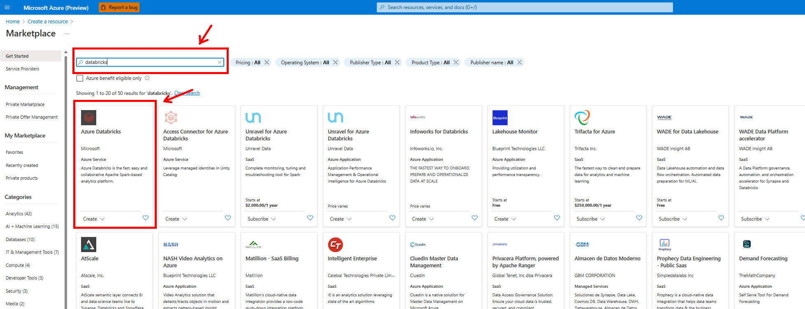
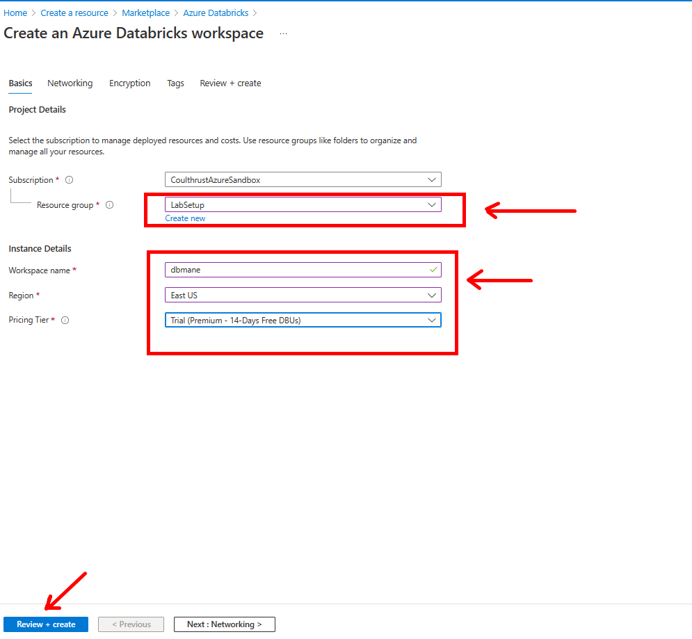
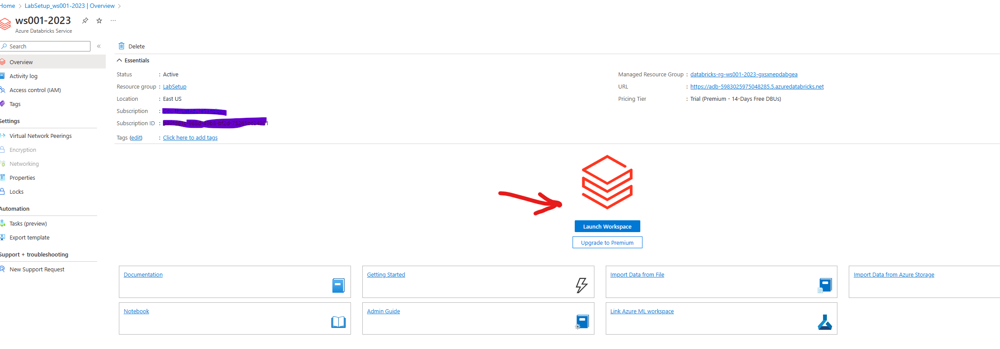
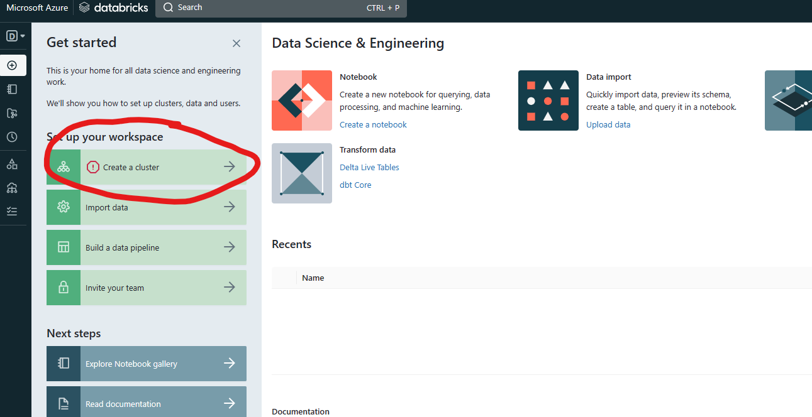
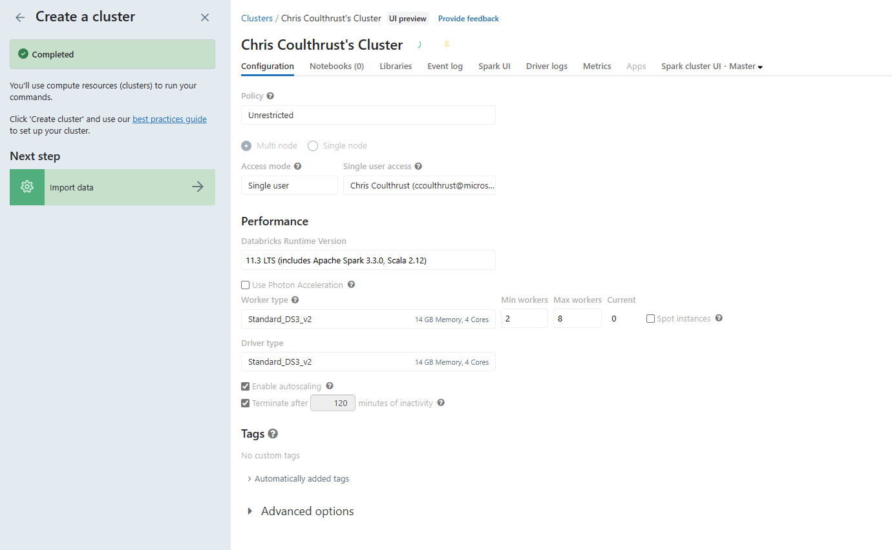
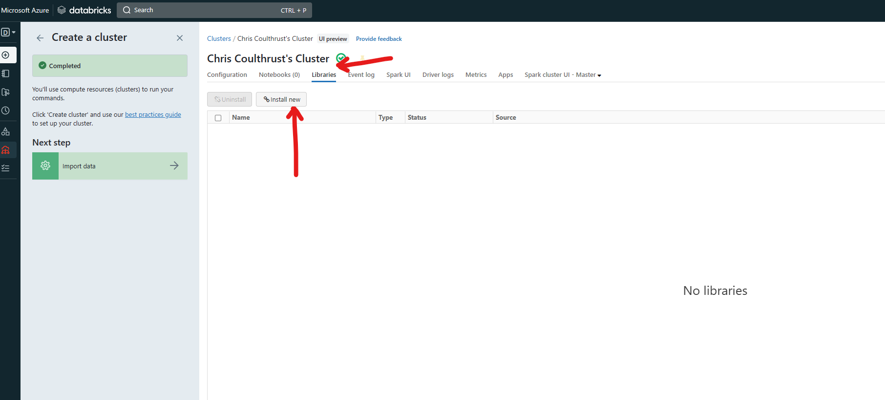
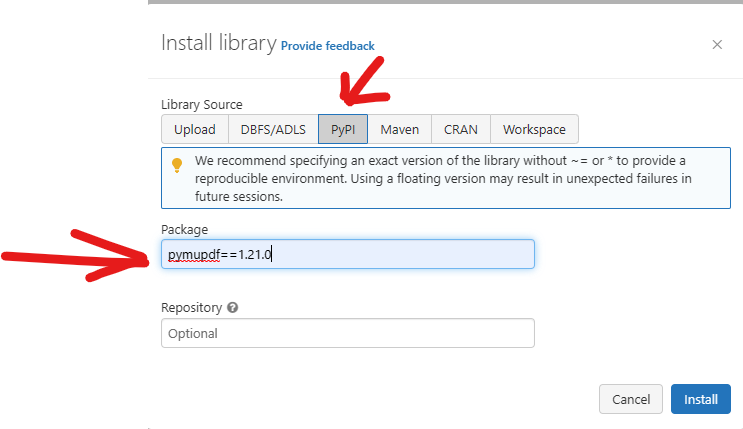
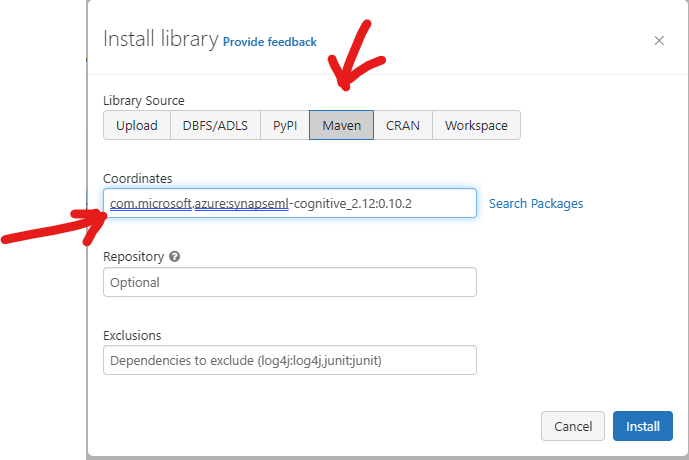

## Databricks Setup

1. Create a Free DataBricks Service in your *Lab* **Resource Group**. [See Documentation Here](https://learn.microsoft.com/en-us/azure/databricks/getting-started/)
1. *Click* **Create a Resource**, type **databricks** and *Click* the **DataBricks** tile.

1. *Select* the *Lab* **Resource Group** , Enter the Instance Details.
    * Workspace Name : *Unique name for your Workspace*
    * Region : **Same Region as you *Lab* Resource Group** 
    * Pricing Tier : *Select* **Free**

1. Once the **Databricks** resource is installed, *Navigate* to Launch Databricks Workspace.
 
1. Create a Cluster
 
1. Using the default settings
 
1. Install PyMUPDF
  
1. Enter **pymupdf==1.21.0**
1. Click **Install**
    
1. [Install SynapseML Package](https://microsoft.github.io/SynapseML/docs/getting_started/installation/#databricks)  NOTE: **Make sure to used Coordinates com.microsoft.azure:synapseml-cognitive_2.12:0.10.2**,otherwise you will get an error.
    
1. Enter **com.microsoft.azure:synapseml-cognitive_2.12:0.10.2** into the **Coordinates**
1. DataBricks will be used later on in the lab for the OpenAI Section
1. Proceed to [OpenAI Modules Here] 

hello
