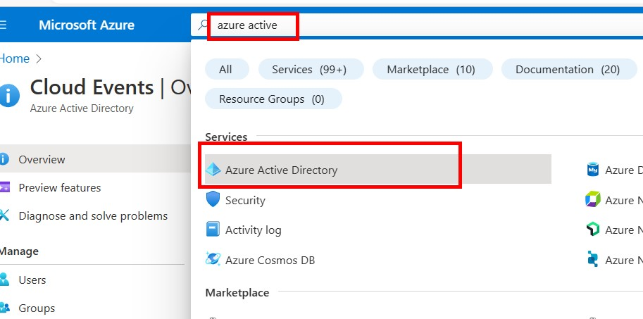
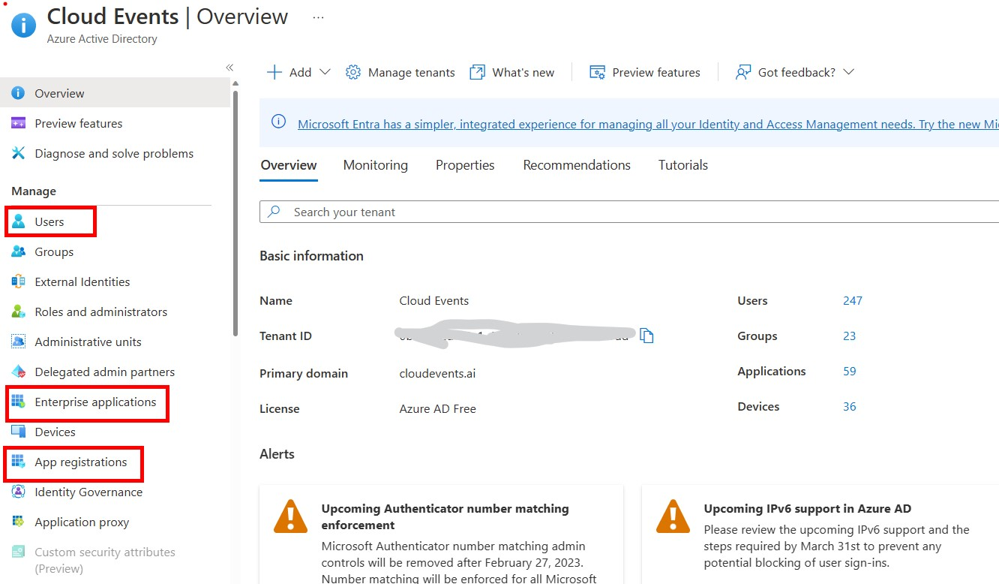
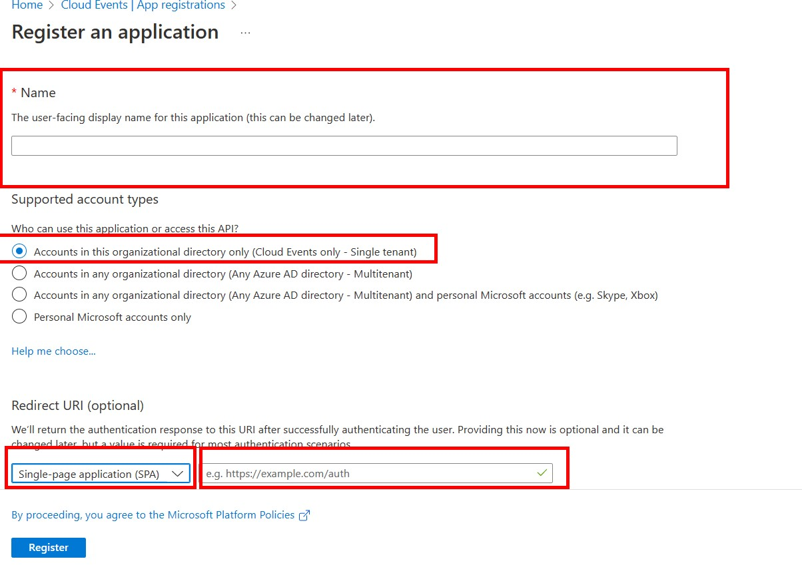
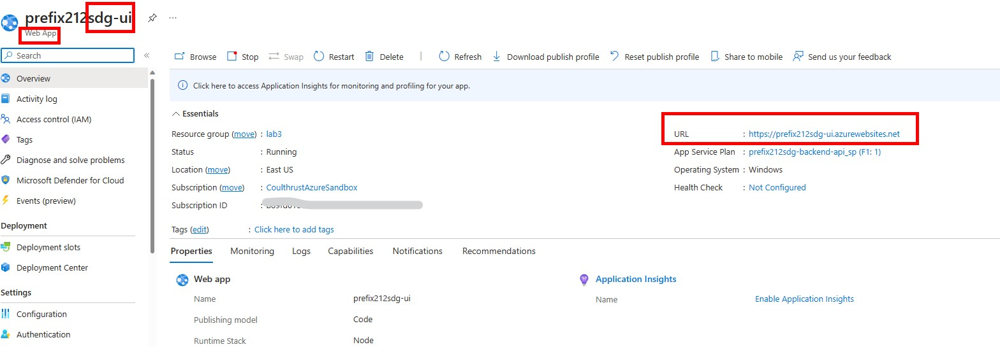
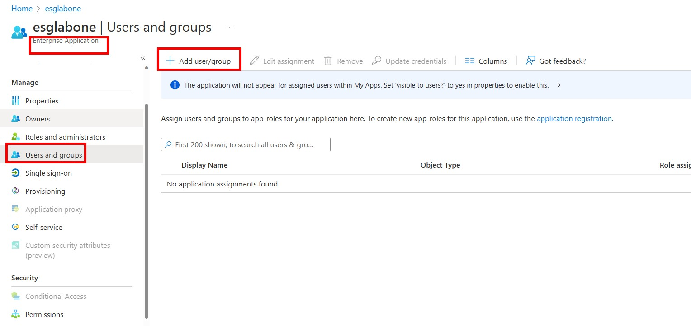
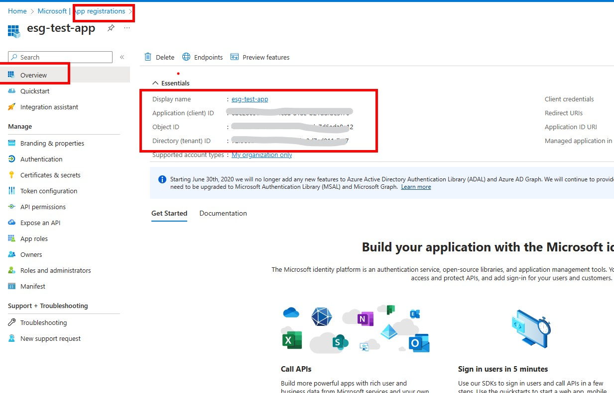
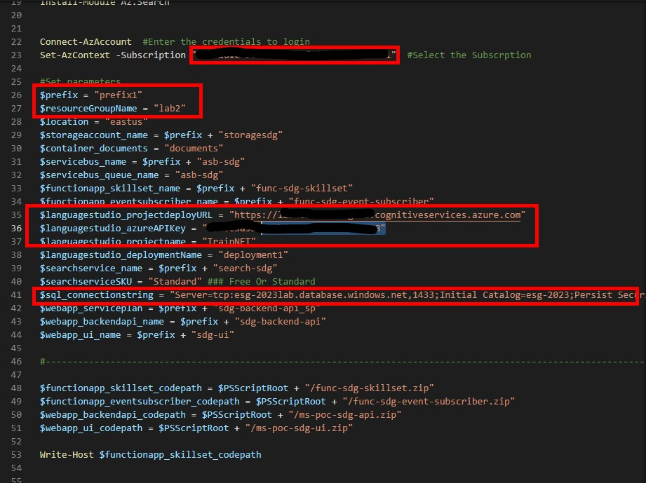
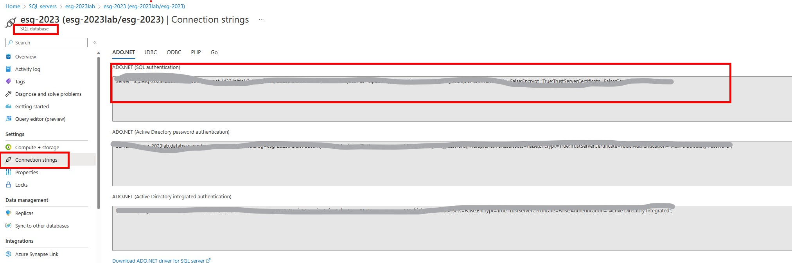

# Front-End UI and Back-End API Install

# Step 0
# Create an app registration 
In this setup the deployed application will be registered in **Azure Active Directory** in order to enable logins. [Additional reading on Application Registation](https://learn.microsoft.com/en-us/azure/active-directory/develop/quickstart-register-app). 
1. In the **Azure Portal** search bar *type* **Azure Active Directory** , *Click** the **Azure Active Directory** service icon.

1. *Click* **App Registrations** >> **New Registration**

1. Enter the details for the application

    * Redirect URI is located in the Web App for the UI as shown, **append /login** to the URL
    * The redirect URL will be: ```https://{**Your Prefix**}sdg-ui.azurewebsites.net/login``` remember to append **/login**

1. To Add User logins to the Enterprise Application *Click* **Enterprise Applications** >> **Enter the Name of the App Registration** created in a previous step. *Click* **Users ang Groups** >> Add user/group >> Users, then enter a username, this can be the user name of the lab or any email address can be invited to the application.


1. Important Information from App Registration, **tenantid** etc located here:  


## Cloud Shell on Azure
1. Go to the cloud shell on Azure , locat the icon in the Azure Portal or go to [shell.azure.com](shell.azure.com).
1. Run the following Power Shell Commands (make sure to switch to Powershell ) these commands will ensure that the necessary **Powershell** modules are install. Confirm **Yes** if a confirmation dialog appears after running the commands. 
```
Install-Module Az
Install-Module Az.ServiceBus
Install-Module Az.Search
```
 
Note: Change Slashes in the deployment file 
3. Copy applicationUI.zip to the **cloudshell** home directory 
* This can be done by selecting **Upload** from **cloudshell** and pasting in the URL of the zip file ```https://github.com/appliedcognetics/esgWorkshop/raw/main/src/workshop/applicationUI/applicationUI.zip```
* When the file is uploaded by url we need to rename the file , from the **cloudshell** type **ls** and you will see **applicationUI[1].zip**.
* While in **Powershell** Rename the file ```Rename-item -Path "applicationUI[1].zip" -NewName applicationUI.zip```
4. unzip the applicationUI.zip ```unzip applicationUI.zip```
5. Update parameters in the deployment file, **type:** ```code ms-poc-sdg-infra-deploy.ps1```
    
    
    * Set-AzContext -Subscription "**Subscription ID here**"
    * $prefix = **Enter a Prefix Name for the services** **THIS WILL BE NEED IN FUTURE STEP**
    * $resourceGroupName = **Name of your resource group**
    * $location = **Location of your resource group**
    * $languagestudio_projectdeployURL = **From Language Service**
    * $languagestudio_azureAPIKey  = **From Language Service**
    * $languagestudio_projectname = **From Language Service**
    * $languagestudio_deploymentName = **From Language Service**
    * $sql_connectionstring = **this is the SQL Database connection string** Ensure the SQL Database is configured [Instructions Here](../documents/part_0.md#deploy-azure-sql-database)

These next two parameters come [from the app registration](#create-an-app-registration) blade.
    * $webapp_ui_clientid  Also known and the **ApplicationID** 
    * $webapp_ui_tenantid  Also Known as **Directory**

 

##  Testing the API Swagger Page Backend API
Once the backend API is deployed it can be tested here , **Replace with the prefix** from the previous deployment as shown in this link.
https://{**Your prefix from app deployment**}sdg-backend-api.azurewebsites.net/Emtec.Cognitive.Search.Api/swagger/index.html


https://{**Your prefix from app deployment**}sdg-ui.azurewebsites.net

# **Next Steps** 
## Smart Search UI 

1. Sample ESG Documents for testing the UI are located here: [ESG Reports](https://github.com/appliedcognetics/esgWorkshop/tree/main/src/workshop/data/ESG_reports)
1. Review Smart Search UI and work with the output [See this document](../documents/part_3.md)
1. Review the Azure Search Indexes , and observe the output of the **Azure Cognitive Services**.


